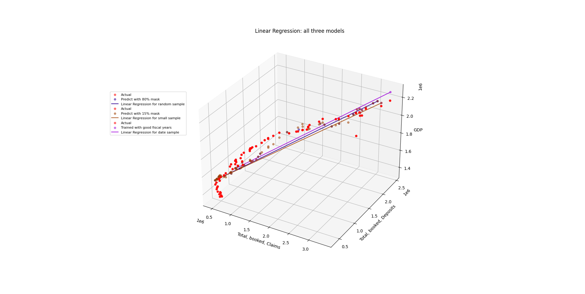

# BiasInAI

## Introduction

I developed this report for a research project given in my Engineering Communications course. We were allowed to choose any topic I decided **ethics in AI** - a subject that I am highly passionate about, would be a great topic to write about. The outline only required us to use 5 papers from after 2018 to support these arguments. With permission from the TA, I went above and beyond by creating my own code for this project to demonstrate how **bias in data selection has an effect on algorithm performance**.

To clearly communicate the differences, I generated a **3D plot of the same model trained in 3 different ways** with the unique data sets. I also included performance of the model like average error and related them to key performance indicators. Relating the models performance with different data sets to key performance indicators allowed me to present my findings in a standardized way that helps build towards a solution to the problem of bias in AI that I had set out to address.

I additionally addressed issues with large conglomerates not being transparent with the AI that they use or interact with. I highlighted the key points on why transparency is important to the public. Another large issue that was confronted was privacy. We know that a good machine learning (ML) model requires relevant data. In order to ensure that the ML model is up to date, companies collect the relevant data and use it to train their ML. I lay out the fundamental rights users must have in order to maintain privacy standards. 

## Methodology

It is a linear regression model trained then tested three different times with three unique data sets. The goal was to **predict Canada’s GDP** using Canada's National Banks Total Assets and Total Book Debit.

- The first data set is a random 80% mask and the remaining 20% was used to test the model.
- The second data set is training the model with only good fiscal years and testing with bad years.
- Finally, the third data set was a random small sample size of 15% and the remaining 85% was to test.

The code for this report was originally for an exercise to get a better understanding in machine learning while improving my Python programming skills. It was suggested to me by my research professor. Then after making a code a few months later I had to write a report 

  

*Figure 1: There is a noticeable difference in the model's performance. This bias results from using poor samples from the population that will result in an overestimate depicted in the light purple line or under prediction displayed with the light brown line. The dependent variable "GDP" is on the positive Z-axis—the two independent variables - Total, Booked, Claims, or Deposits are along the X and Y axis. The scattered dots are the precise data points for the creation of the regression line.*

## Model Assessment

Performance metrics
